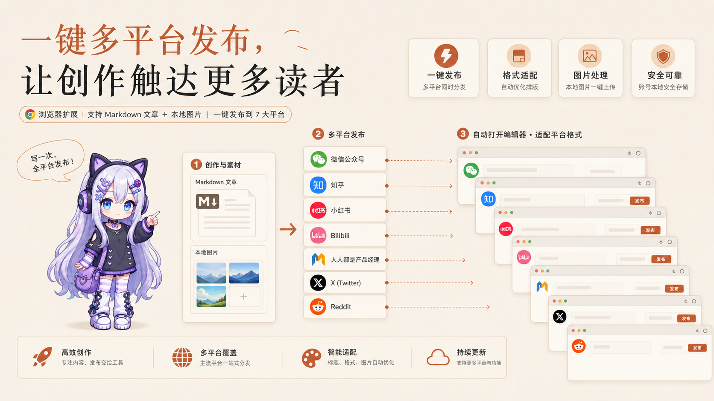
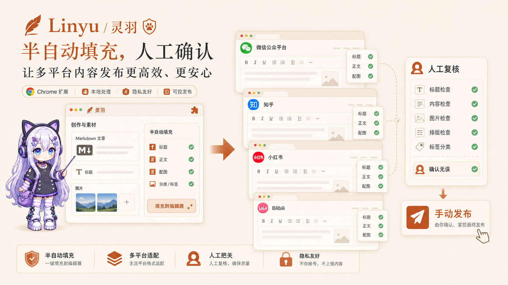
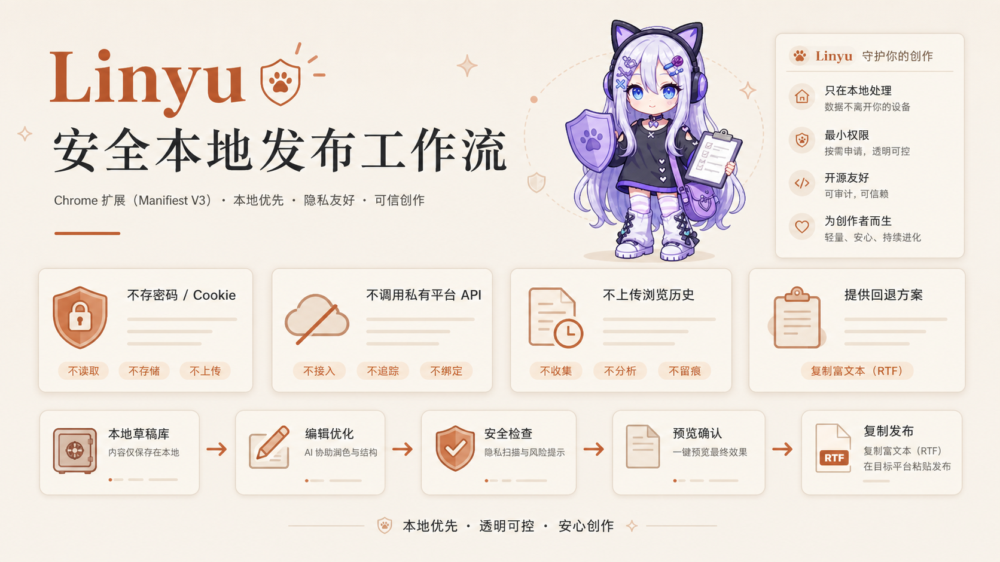

# Linyu · Multi-Platform Publishing Assistant v2

[中文](README.md) | [English](README.en.md)


`linyu` is a Chrome Manifest V3 extension for creators who publish the same Markdown article and local images across multiple content platforms. v2 brings writing, image handling, short-form variants, pre-publish checks, editor filling, history management, and backup/restore into one local-first semi-automated workflow.

Linyu does not call private publishing APIs and does not click the final publish button. It opens the target platform editor and fills the title, body, images, or short-form copy where possible. The final review and publish action stay with the user.

---

## Visual Introduction

### 1. Write Once, Distribute Across Platforms



Create a task in the composer, paste a Markdown body, import local images, and prepare per-platform versions. Long-form platforms use the full article, while short-form platforms use generated or manually edited variants.

### 2. Semi-Automated Filling, Human Confirmation



Linyu sends the content into native platform editors while keeping each platform's login, preview, review, and publish flow intact. It is designed for faster distribution without giving up manual quality control.

### 3. Local-First, No Uploaded History



Drafts, images, and settings live in browser local storage. Runtime history, build output, and debug caches are not committed to the repository. If auto-fill breaks, copy-as-rich-text is available as a fallback.

---

## v2 Highlights

- **7 auto-fill platforms**: WeChat Official Account, Zhihu Column, Xiaohongshu, Bilibili Column, Woshipm, X, and Reddit.
- **7 quick-jump platforms**: Weibo article, Jianshu, Juejin, CSDN, Toutiao, Douban, and Medium, configurable in settings.
- **Composer upgrade**: Markdown editing, HTML preview, full-screen split mode, reusable snippets, and one-click rich-text copy.
- **Image workflow**: drag-and-drop import, screenshot paste, caret-position insertion, cover marking, preview reordering, crop, rotate, flip, and compression.
- **Platform variants**: separate copy for Xiaohongshu, X, and Reddit, with manual edits before dispatch.
- **Pre-publish inspection**: platform-level checks for title, body, images, cover, length, and missing variants.
- **History and backup**: auto-save tasks, search/delete/duplicate history, and full JSON export/import.
- **Maintenance tools**: adapter self-check helps locate broken selectors when platforms change their editors.
- **Engineering**: WXT + React + TypeScript, Vitest, ESLint, and GitHub Actions for lint/test/build.
- **Showcase site**: `showcase/` contains a standalone Astro case-study site for personal portfolio use.

---

## Use Cases

Good fit:

- One long article needs to be published to several content platforms.
- The Markdown body contains local images and should keep a basic layout.
- Xiaohongshu, X, or Reddit need shorter versions derived from a long article.
- You still want a human to review platform rules, images, title, and final rendering.

Not a fit:

- Bypassing platform review or auto-clicking final publish buttons.
- Bulk publishing through private platform APIs.
- Storing credentials, cookies, or platform login tokens.

---

## Installation

This repository contains source code. Build the extension first, then load it in Chrome:

```powershell
git clone https://github.com/VioletScar-Hui/linyu.git
cd linyu
npm install
npm run build
```

The build output is `.output/chrome-mv3`. Open Chrome:

```text
chrome://extensions
```

Enable "Developer mode", click "Load unpacked", and select `.output/chrome-mv3`.

After editing source code, run `npm run build` again and reload the extension on the Chrome extensions page.

---

## First Run

1. Click the Linyu icon in the browser toolbar.
2. Create a distribution task, enter a title, and paste the Markdown body.
3. Drag in local images, or paste screenshots into the editor with `Ctrl+V`.
4. Insert images at the caret position when needed, or use the image gallery to set a cover, crop, rotate, or compress.
5. Generate or edit variants for Xiaohongshu, X, and Reddit.
6. Review the pre-publish inspection panel.
7. Select target platforms and dispatch filling.
8. Review the native platform editor manually, then publish yourself.

---

## Supported Platforms

### Auto-Fill

| Platform | Match | Capability |
| --- | --- | --- |
| WeChat Official Account | `mp.weixin.qq.com` | Title, summary, body-with-images; multi-account jump; cover selected from body |
| Zhihu Column | `zhuanlan.zhihu.com` | Title, body, and image filling |
| Xiaohongshu Creator | `creator.xiaohongshu.com` | Switch to image-post entry, upload images, fill title and body variant |
| Bilibili Column | `member.bilibili.com` | Column title and body filling; images need editor confirmation |
| Woshipm | `woshipm.com` | Article title and body filling |
| X | `x.com` | Tweet variant and image filling |
| Reddit | `reddit.com` / `old.reddit.com` | Title and Markdown body filling |

### Quick Jump

Weibo article, Jianshu, Juejin, CSDN, Toutiao, Douban, and Medium currently provide editor-entry jumps only. They can be enabled or disabled in settings.

Platform pages change over time. If filling fails, use "copy rich text" as a manual fallback. Then open the popup on that platform editor page, run the current-page adapter self-check, and update the `SELECTORS` in `lib/adapters/<platform>.ts`.

---

## Data and Privacy

- Task bodies, images, platform status, and settings are stored in browser `storage.local`.
- v2 stores tasks as `task:{id}` plus a lightweight `taskIndex`, so the history list does not load every image every time.
- The extension keeps up to 20 recent tasks and prunes older ones.
- JSON export/import backs up tasks and settings.
- No credentials, cookies, or login tokens are stored.
- Browser history is not uploaded, and runtime task history is not committed.
- `.gitignore` excludes `node_modules/`, `.wxt/`, `.output/`, and `preview/out.js`.

Chrome usually stores extension runtime data inside the user's browser profile. Repository source code, build output, and browser-local task history are separate things.

---

## Development

```powershell
npm run dev        # WXT hot-reload development
npm test           # Vitest unit tests
npm run lint       # ESLint
npm run build      # build to .output/chrome-mv3
npm run preview    # composer visual preview, usually http://localhost:5199
npm run icons      # regenerate extension icons
```

CI lives in `.github/workflows/ci.yml` and runs on push and pull request:

```text
npm ci -> npm run lint -> npm test -> npm run build
```

---

## Showcase Site

`showcase/` is a standalone Astro project for presenting Linyu inside a personal portfolio. It includes:

- A homepage project-card entrance.
- `/projects/linyu`, the independent case-study page.
- `/components`, project-card component states.

Run locally:

```powershell
cd showcase
npm install
npm run dev
```

For Vercel, Netlify, or Cloudflare Pages, set the root directory to `showcase`, build command to `npm run build`, and output directory to `dist`.

---

## Repository Structure

```text
linyu/
  entrypoints/              # WXT entries: popup, composer, content scripts, background
  entrypoints/composer/     # Composer UI: history, images, variants, preflight, settings, preview
  lib/                      # Markdown, images, tasks, settings, backup, preflight logic
  lib/adapters/             # Platform SELECTORS, filling logic, and self-checks
  preview/                  # Composer visual preview server
  public/                   # WXT static assets and extension icons
  scripts/                  # Icon generation scripts
  showcase/                 # Standalone Astro portfolio case-study site
  tests/                    # Vitest unit tests
  assets/                   # README visuals
  wxt.config.ts             # WXT config and manifest fields
  eslint.config.js          # ESLint flat config
  .github/workflows/ci.yml  # CI
```

---

## FAQ

### Why not fully automatic publishing?

Login state, editor behavior, review rules, and publish confirmation differ by platform. Linyu only fills content and assists navigation; final publish is manually confirmed by the user.

### Does Linyu upload my history to the repo or a server?

No. Task history lives in browser-local `storage.local`; the repository only stores source code. Build output, runtime caches, and local dependencies are excluded by `.gitignore`.

### What if auto-fill fails?

Use "copy rich text" to paste manually into the platform editor. Then run the adapter self-check on that page and update the corresponding selectors.

### Why does this README say v2 while `package.json` says `1.0.0`?

v2 refers to the current feature/documentation iteration, not an npm package release. This project is a personal Chrome extension source repository rather than a published npm package.

---

## License

This repository includes a [`LICENSE`](LICENSE) file; see it for the exact terms.
